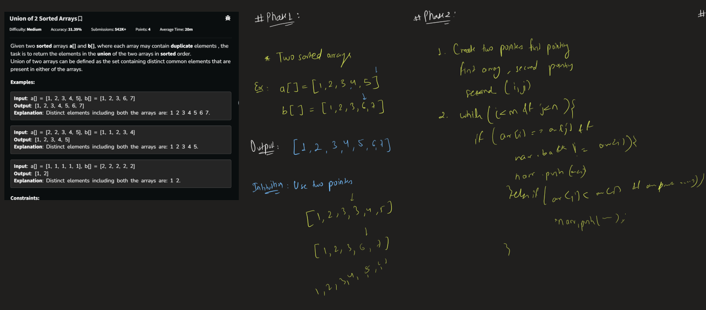
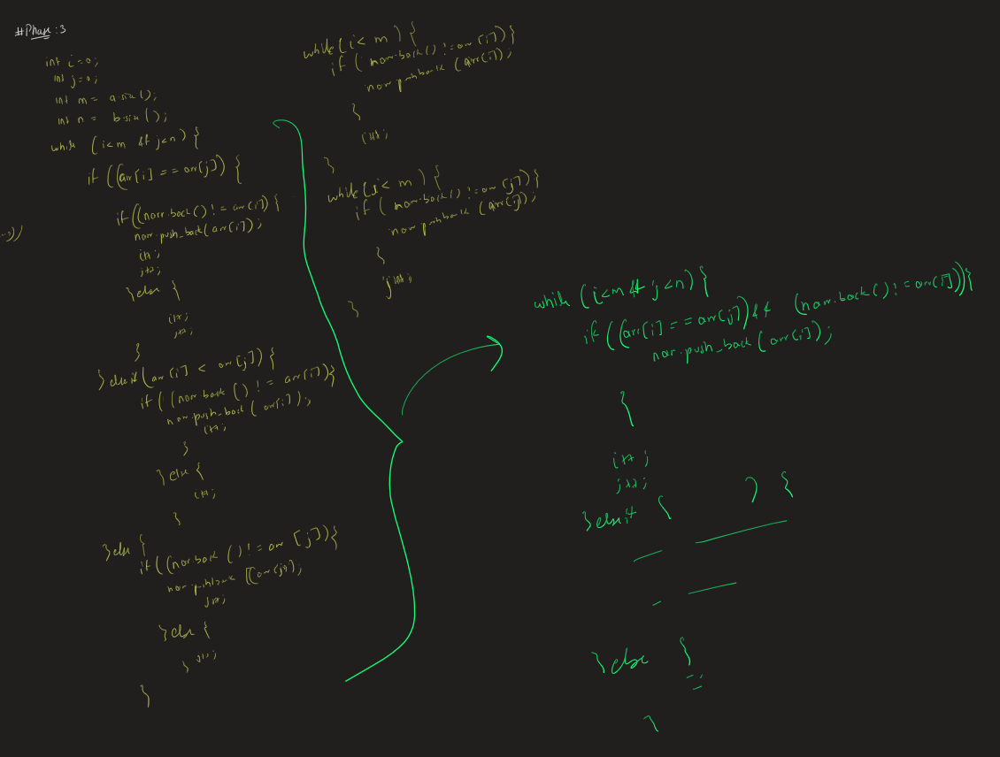
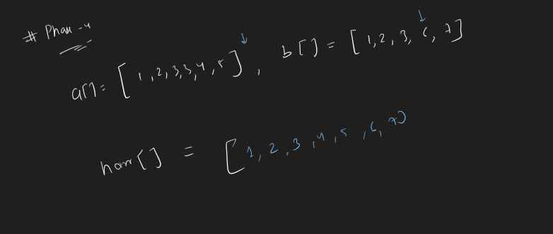

# Union of 2 Sorted Arrays

**Platform:** GeeksforGeeks  
**Difficulty:** Medium  
**Topics:** Arrays, Two Pointers, Sorting

---

## Problem

Given two sorted arrays `a[]` and `b[]`, find the **union** of both arrays.

The union should contain all distinct elements from both arrays in sorted order.

---

## Approach

Since both arrays are already sorted, we can use the **Two Pointers** approach.

- Use `i` to traverse array `a`.
- Use `j` to traverse array `b`.
- Compare `a[i]` and `b[j]`.
- Add the smaller element to the result.
- If both elements are equal, add the element only once and move both pointers.
- Skip duplicate elements by checking the last element added to the result.
- After one array is completely traversed, add the remaining unique elements from the other array.

---

## Algorithm

1. Initialize two pointers:

   ```cpp
   int i = 0, j = 0;
   ```

2. Create an empty vector to store the union:

   ```cpp
   vector<int> narr;
   ```

3. While both arrays have remaining elements:
   - If `a[i] < b[j]`, add `a[i]` if it is not already present at the end of the result, then increment `i`.
   - If `b[j] < a[i]`, add `b[j]` if it is not already present at the end of the result, then increment `j`.
   - If `a[i] == b[j]`, add the element only once and increment both pointers.

4. Add the remaining unique elements from array `a`, if any.

5. Add the remaining unique elements from array `b`, if any.

6. Return the resulting union array.

---

## Time Complexity

**O(m + n)**

Both arrays are traversed at most once.

---

## Space Complexity

**O(m + n)**

The result vector stores the union of both arrays.

---

## Key Insight

Because both arrays are already sorted, we can compare their elements using two pointers and construct the union in sorted order.

The condition below prevents duplicate elements from being added:

```cpp
narr.empty() || narr.back() != currentElement
```

---

## Edge Cases

- One or both arrays are empty.
- Both arrays contain duplicate elements.
- Both arrays contain the same elements.
- One array is completely smaller than the other.
- One array is a subset of the other.
- Arrays contain only one element.

---

## Handwritten Notes






