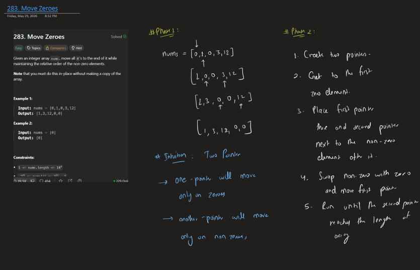
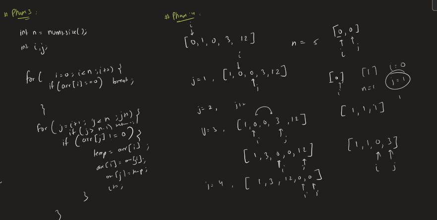

# 283. Move Zeroes

**Platform:** LeetCode

**Difficulty:** Easy

**Topic:** Arrays, Two Pointers

---

## Problem

Move all `0`s to the end of the array while maintaining the relative order of the non-zero elements.

---

## Approach

### Phase 1 – Understanding

- Need to maintain relative order.
- Must solve in-place.
- Extra array is not allowed.

### Phase 2 – Intuition

Find the first zero.

Whenever a non-zero element appears after it, swap them.

Continue moving the zero pointer forward.

---

## Algorithm

1. Find the first occurrence of `0`.
2. Traverse the remaining array.
3. If a non-zero element is found:
   - Swap with the zero.
   - Move the zero pointer ahead.
4. Continue until the end.

---

## Time Complexity

**O(n)**

## Space Complexity

**O(1)**

---

## Handwritten Notes

